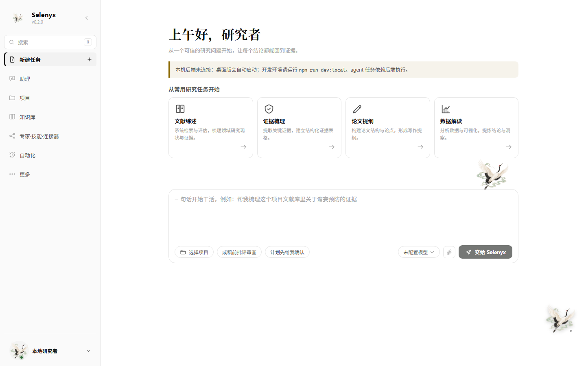
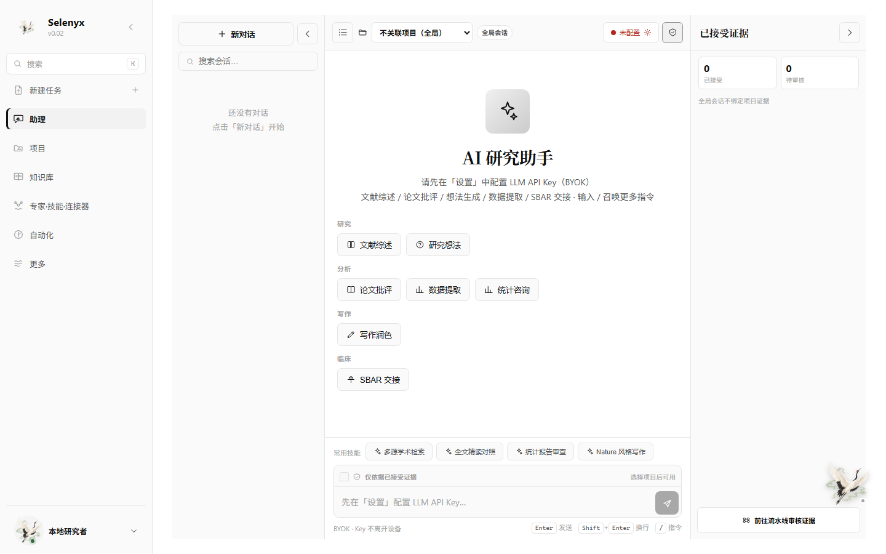
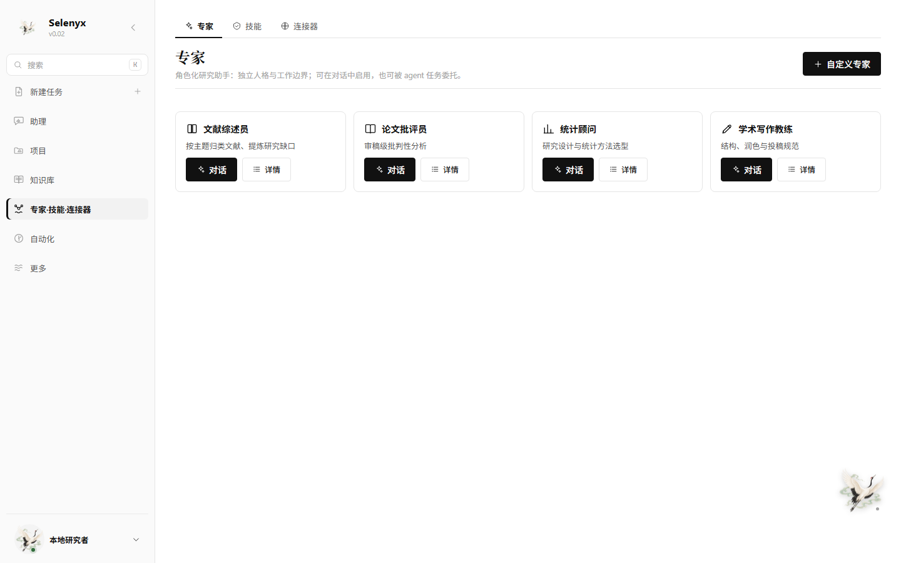
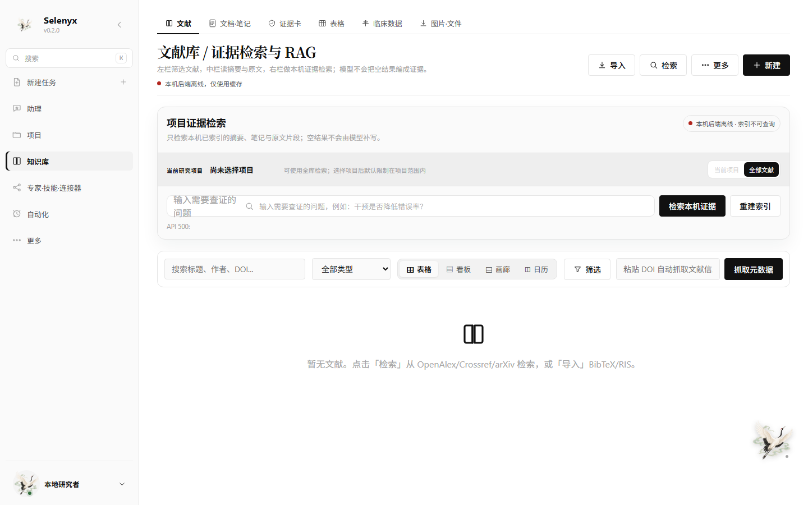
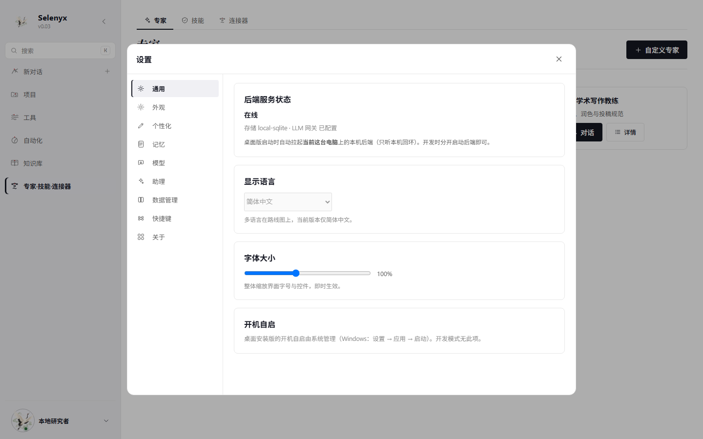

<div align="center">

# Selenyx 科研工作台

**本地优先的证据链 AI 科研助手 —— AI 干活，人签字**

展翼丹顶鹤为记 —— 安静、专注、行稳致远。

`v0.03` &nbsp;·&nbsp; `React + TypeScript + Vite` &nbsp;·&nbsp; `Tauri 2 (Rust)` &nbsp;·&nbsp; `FastAPI + SQLite`



</div>

---

## 这是什么

Selenyx 把科研工作流收进**一个完全在你本机运行**的工作区：文献管理、PDF 阅读批注、研究项目与八段流水线、统计工具、全学科资料、AI 对话与 agent 任务。数据存于本机 SQLite 与本地存储——**不注册、不上云、离线可用**。

与一众"自动成稿"的科研 AI 不同，Selenyx 交付的不是一份报告，而是**一条证据链**：agent 负责跑断腿（检索/提取/起草/自批评），人负责落锤（接受/驳回证据）。**可信不是功能，是架构。**

> 功能真实性、原文可追溯、人工证据门，优先于装饰与功能数量。

## 签名功能

- **证据卡一等公民**：agent 每次检索/阅读产出结构化证据卡（论断/原文摘录/页码/来源），进入「待裁决」队列；键盘 J/K 一键接受或驳回。
- **成稿证据染色**：综述/提纲逐句标注支撑——🟩 已接受证据 / 🟨 候选 / 🟥 无据断言；`[^e:id]` 标记经后端真实性校验，**编造引用直接打回修订**。
- **证据覆盖率徽标**：每篇成稿头部量化可信度（有据论断占比 + 人工接受占比）。
- **可重放的 run**：计划 → 每次工具调用 → 每次观察 → 批评意见 → 修订稿，全程留痕可回放。
- **仙鹤伙伴**：桌面桌宠（趴主窗上沿），任务完成飞来报喜；有待裁决证据时头顶黄点静立；点它答「今天做了什么」。

## 界面

| 新建任务主页（时段问候 + 模板卡 + Composer） | 知识库 · 证据卡队列（J/K 人工裁决） |
|---|---|
|  |  |

| 助理（会话可转任务，产出回贴） | 专家·技能·连接器（三合一） |
|---|---|
|  |  |

| 知识库 · 文献（检索 + 行内导出/删除） | 设置弹窗（Ctrl+,，9 分区） |
|---|---|
|  |  |

默认**墨白**黑白极简主题（仅新装）；另有纸间豆绿、瑞士蓝、墨岩·新粗野，均支持日夜切换与三档密度——同一份 DOM，只换设计令牌，不重排信息架构。

## 功能特性

- **Agent 任务**：研究目标交给本机 agent 自循环（规划 → 检索 → 执行 → 成稿）；SSE 流式步骤、运行中插话（steer）、计划先确认、秒级取消；可选「成稿前批评审查」。
- **专家流水线**：综述流水线 recipe（综述员起草 → 批评员审 → 修订 → 证据染色成稿）；内置 4 位专家人格，可单独对话，可被 agent 委托为子代理。
- **技能与记忆**：SKILL.md 技能包（`/技能名` 调用，注入指令并裁剪工具白名单）；全局 + 项目两层记忆，run 启动注入、结尾沉淀，永不外发。
- **文献库**：DOI / PMID / arXiv / BibTeX / RIS / CSL JSON 导入，本机 Zotero 只读导入（候选预览 → 去重 → 确认），重复项**合并**而非删除；zotero 风格引用键；PDF 阅读批注。
- **本地 RAG**：结构化解析（保留页码/偏移）→ 稀疏 + 稠密混合检索 → 重排 → 人工证据门；解析失败保留原文件并显示原因。
- **学术连接器**：OpenAlex / Crossref / PubMed / arXiv 真实探测（超时 + 缓存，诚实空结果，绝不编造）。
- **MCP 接入**：添加 stdio / SSE MCP server（最小客户端 initialize/tools-list/tools-call），工具以 `mcp:` 前缀进 agent 白名单；SSRF 防护（拒绝环回/私网/任意 header/重定向）。
- **自动化 2.0**：cron 表达式（零依赖自研解析）、失败指数退避重试 ×3、停机错过补偿（可关）、运行历史可跳任务详情。
- **统计工具 / 全学科资料 / 工具箱**：名词、数值、公式、标准规范均标注来源与适用范围。

## 安装

### 下载安装包（推荐）

到 [**Releases**](https://github.com/pyrelio88-afk/Selenyx/releases) 下载：

| 平台 | 文件 |
|---|---|
| Windows | `Selenyx_…_x64-setup.exe`（NSIS）/ `…_x64_en-US.msi` |
| macOS | `Selenyx_…_aarch64.dmg` |
| Linux | `.deb` / `.rpm` / `.AppImage` |

标准安装包**不含** AI 模型与大型离线安装器；OCR / 嵌入 / 重排模型按需单独安装、显示大小与许可证、可卸载，模型缺失不影响文献、笔记、统计与项目管理。

### 从源码运行

前置：Node ≥ 20、Python（[uv](https://docs.astral.sh/uv/)）；桌面构建另需 Rust。

```powershell
npm install
npm run dev:local   # 同时启动前端 + 本地后端（/api 代理）
```

仅前端（无 RAG/学术网关）：`npm run dev`。桌面应用：`npm run desktop:build`（含本机 FastAPI sidecar 打包，详见 [BUILD.md](BUILD.md)）。

### 配置 AI（BYOK）

设置弹窗（`Ctrl+,`）→ 模型：填入你的 OpenAI / OpenRouter / Anthropic / Google / 本地 Ollama 的 Key 与模型名。Key 只存本机，永不进可分发产物。

## 使用示例

**做一次可信综述**

1. 主页点「文献综述」模板卡（自动挂载综述流水线）→「交给 Selenyx」
2. 计划确认 → 流式观看综述员起草、批评员审查、修订
3. 知识库 · 证据卡：J/K 批掉待裁决队列
4. 成稿按句染色 + 头部覆盖率徽标 → 一键写入笔记 / 下载 .md

**无人值守每日动态**

自动化 → 新建：cron `0 8 * * *` + 任务描述 → 到点自动跑，失败 1/2/4 分钟退避重试；运行历史可跳每次详情。

**接入你的 MCP 工具**

专家·技能·连接器 → 连接器 → 添加 MCP server（stdio 填可执行绝对路径 + 参数；SSE 填公网 URL）→ 探测 → agent 即可调用 `mcp:` 前缀工具。

## 验证

```powershell
npm run typecheck    # TypeScript
npm run lint         # ESLint
npm test             # 前端单元测试（155）
npm run backend:test # 后端 pytest（112）
npm run verify:local # 本地优先整体验证
```

## 技术栈与架构

- **前端**：React + TypeScript + Vite（单文件构建）+ Zustand；三栏工作台骨架（对象目录 — 主工作区 — 证据检查器）
- **桌面**：Tauri 2（Rust）；仙鹤桌宠为透明置顶窗
- **后端**：FastAPI + SQLModel/SQLite 本地 sidecar（127.0.0.1:8770，BYOK 密钥网关）
- **PDF / OCR**：pdf.js + anydoc

架构细节见 [ARCHITECTURE.md](ARCHITECTURE.md)；构建与体积基线见 [BUILD.md](BUILD.md)；本地 RAG 见 [docs/LOCAL-RAG-EMBEDDINGS.md](docs/LOCAL-RAG-EMBEDDINGS.md)。

## License

MIT
