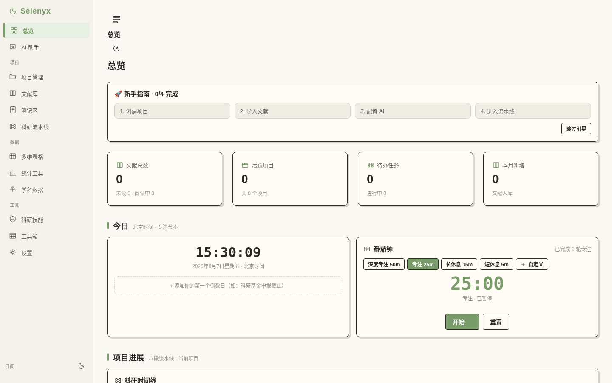
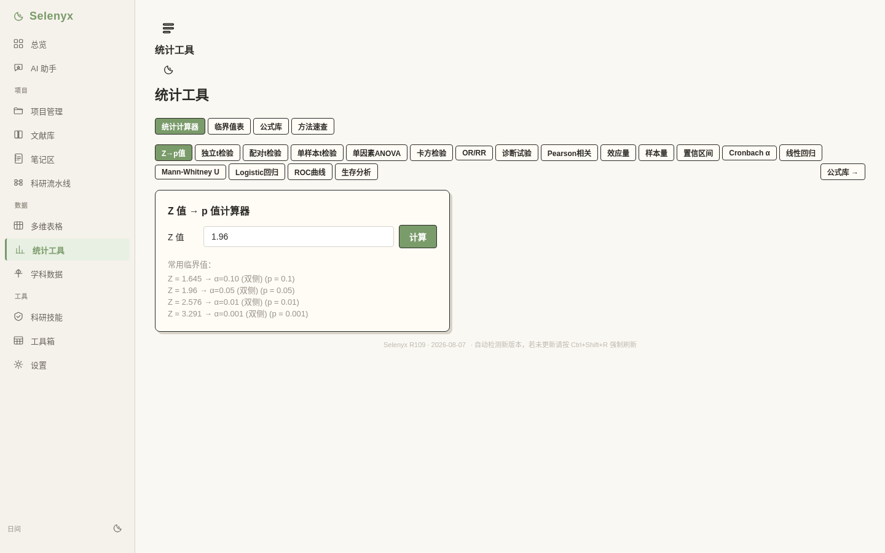
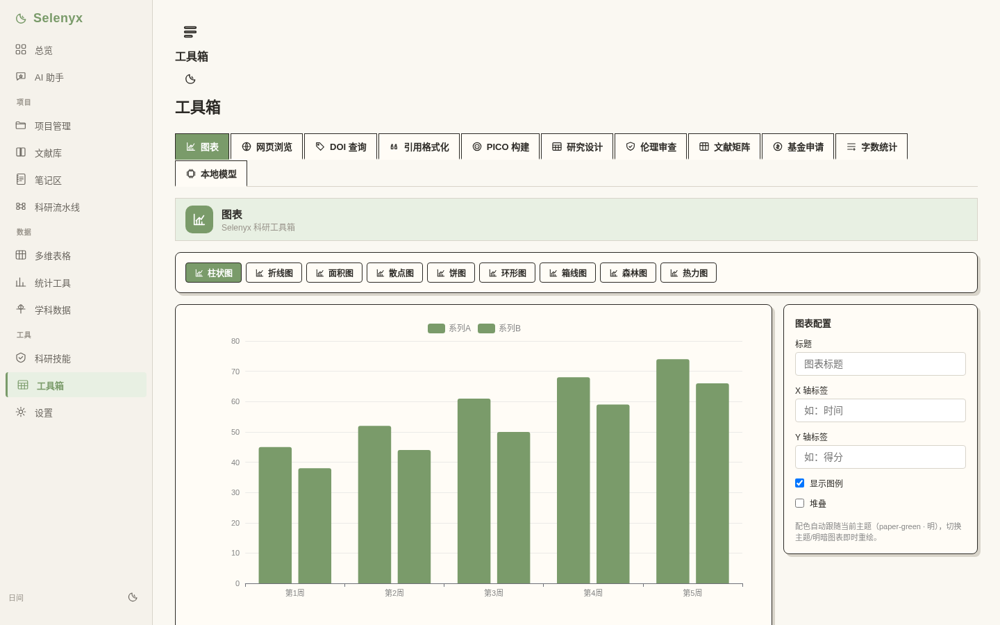
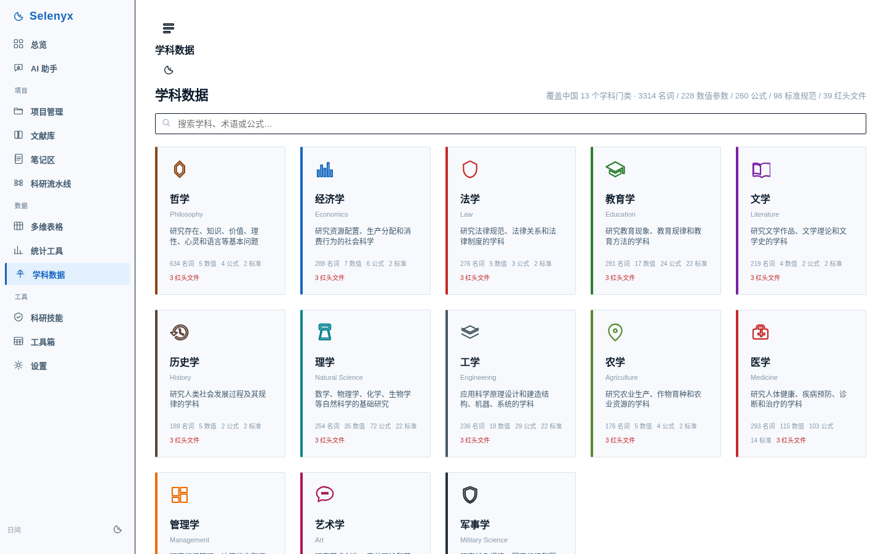
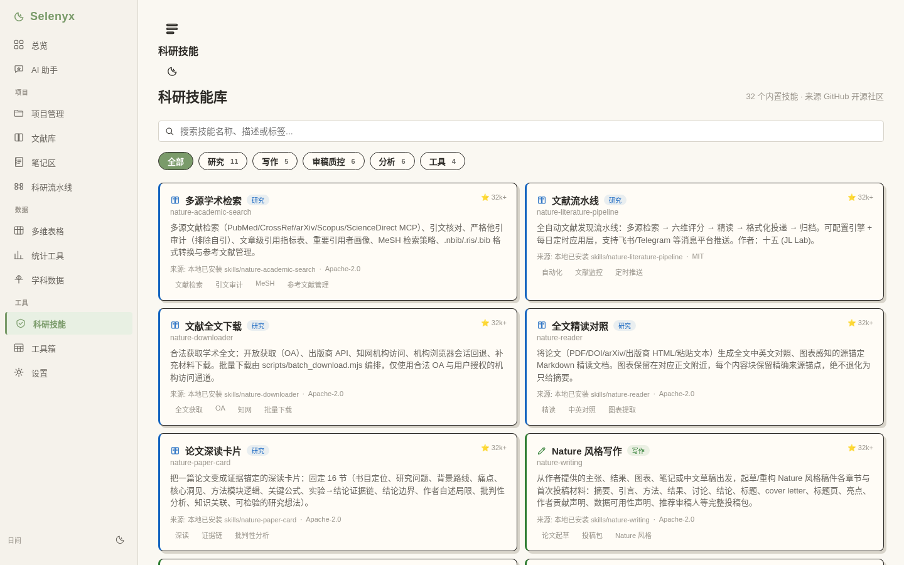
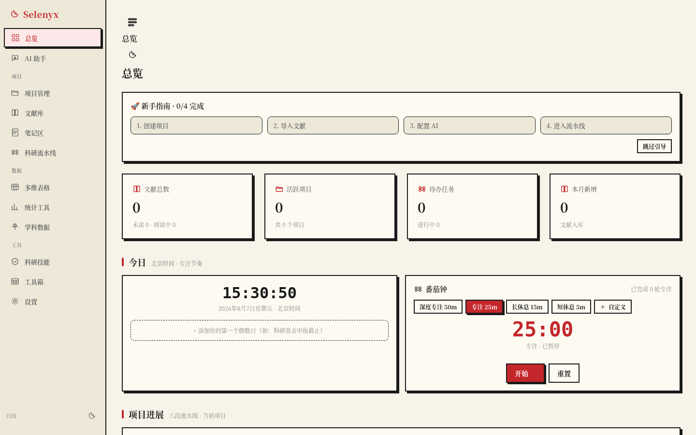

# Selenyx 科研工作台

> 本地优先 · 八段科研流水线 · 面向护理科研的端到端工作台

**Selenyx** 将文献管理、PDF 标注、证据综合、统计分析和论文写作整合到一个可停靠的工作区中。你的数据永远留在你的机器上，除非你明确选择导出。

## 界面预览

| 总览仪表盘 | 统计工具（18 个计算器） |
|:---:|:---:|
|  |  |

| 工具箱 · 图表 | 学科数据（13 学科门类） |
|:---:|:---:|
|  |  |

| 科研技能库（32 个内置技能） | 墨岩主题 |
|:---:|:---:|
|  |  |

## 八段科研流水线

```
① 问题 → ② 文献 → ③ 全文 → ④ 筛选 → ⑤ 精读 → ⑥ 证据 → ⑦ 综合 → ⑧ 写作
 PICO     检索     PDF入库   纳排标准   深度阅读   GRADE分级   推理链     论文+投稿
```

每阶段有明确的**入口条件 → 产出物 → 质检门**，构成可追溯的科研工作流。

## 功能矩阵

### 文献管理（Zotero 式）
- 30 种文献类型 × 57 字段
- BibTeX / RIS / CSV / CSL-JSON 导入导出
- 多源在线检索（PubMed / Crossref / arXiv）
- 三策略去重（DOI / PMID / 标题+年份）
- 加权搜索（标题×10 / DOI×6 / 作者×5 / 期刊×4 / 摘要×2）
- APA7 / Vancouver / GB-T7714 / AMA 四种引用格式
- anydoc 文档转 Markdown（PDF / Word / Excel → Markdown，WASM 本地转换）
- 内置 OCR（Tesseract.js，扫描版 PDF / 图片文字识别）

### 科研流水线
- PICO 结构化问题
- SBAR 课题管理
- 八段流水线阶段推进 + 质检门
- PRISMA 流程图
- 46 个研究框架（Science / Nature / EQUATOR 标准）

### 笔记区
- 新建 / Markdown 编辑 / 分类标签 / 搜索
- 关联文献与流水线段
- 持久化迁移（schema versioning）

### 统计工具
- **18 个统计计算器**：Z-p 值、独立/配对/单样本 t 检验、单因素 ANOVA、卡方检验、OR/RR、诊断试验、Pearson 相关、效应量、样本量、置信区间、Cronbach α、线性回归、Mann-Whitney U、Logistic 回归、ROC 曲线、生存分析
- 临界值表（Z / t / χ² / F 分布）
- 公式库（15 公式，与计算器双向跳转）
- 70+ 统计方法库（含 R / Python / SPSS 代码示例）
- GRADE 证据分级
- CONSORT / STROBE / CASP / RoB 2.0 / NOS / AMSTAR 2 / JBI / PRISMA 2020 质量评价清单

### 图表可视化
- ECharts 8 类科研图：柱状图 / 折线图 / 面积图 / 散点图 / 饼图 / 环形图 / 箱线图 / 森林图 / 热力图
- CSV 导入 + PNG / SVG 导出
- 主题自适应配色
- 统计-图表深度融合：Logistic 森林图、卡方列联表热力图

### 学科数据
- 覆盖中国 13 个学科门类
- 3314 名词 / 228 数值参数 / 260 公式 / 98 标准规范 / 39 红头文件
- 实验室检验值（110+ 项 × 15 分类，含危急值 / 护理要点 / 干扰因素）
- NANDA-I 护理诊断（254 条 × 13 领域）
- 护理科研术语表（383 条，中英对照）
- 期刊信息库（含影响因子 / 分区 / 版面费 / 审稿周期）

### AI 研究助手
- 多会话管理 + Markdown 渲染 + 代码高亮 + 流式对话
- 快捷指令 + 会话分支 + 模型切换
- 科研技能推荐（研究框架驱动 → nature-* 技能映射 → 一键注入）
- 研究配方：文献综述 / 论文批评 / 想法生成 / 数据提取 / 质量评价 / SBAR 交接

### 科研技能库
- 32 个内置技能，全部来自 GitHub 开源社区
- 按分类筛选：研究（11）/ 写作（5）/ 审稿质控（6）/ 分析（6）/ 工具（4）

### 多维表格
- 表格 / 看板 / 画廊 / 时间线 / 日历 五种视图
- 自定义字段（11 种类型）
- 筛选 / 排序 / 分组 / 公式

### 工具箱
- 网页浏览 / DOI 查询 / 引用格式化 / PICO 构建 / 研究设计 / 伦理审查 / 文献矩阵 / 基金申请 / 字数统计 / 本地模型
- 番茄钟（自定义事件）+ 倒数日 + 北京时间时钟

### 跨平台
- Web：任意浏览器（单文件部署）
- 桌面：Windows / macOS / Linux（Tauri v2）
- 移动：Android / iOS（Tauri v2 Mobile）
- 移动端全局触控优化（BottomSheet / 响应式 / safe-area）

## 技术栈

- **前端**：React 19 + TypeScript + Vite + Zustand
- **PDF**：PDF.js 全文阅读器 + 五色批注层 + textLayer 选区高亮
- **可视化**：ECharts（tree-shaken）
- **OCR**：Tesseract.js（chi_sim + eng）
- **文档转换**：@firecrawl/anydoc-wasm（WASM 本地转换）
- **部署**：单文件 HTML（single-file build）
- **主题**：纸间豆绿 / 瑞士杂志 / 墨岩，各主题昼夜双模式

## 快速开始

### 前提条件
- Node.js ≥ 20 + pnpm ≥ 9

### 开发模式

```bash
pnpm install
pnpm dev          # http://127.0.0.1:5173
```

### 构建

```bash
pnpm build        # 单文件 HTML 产物
```

## 隐私

Selenyx 将隐私视为架构属性，而非设置项：
- **本地优先**：所有数据存储在你的机器上（localStorage 持久化）
- **不编造**：extractive retrieval 引用原文段落，带精确定位
- **无遥测**：Selenyx 不发送任何关于你、你的项目或使用方式的数据

## License

MIT

---

*Selenyx = Selene（月神，学术之光）+ Nyx（夜神，深思之境）*
