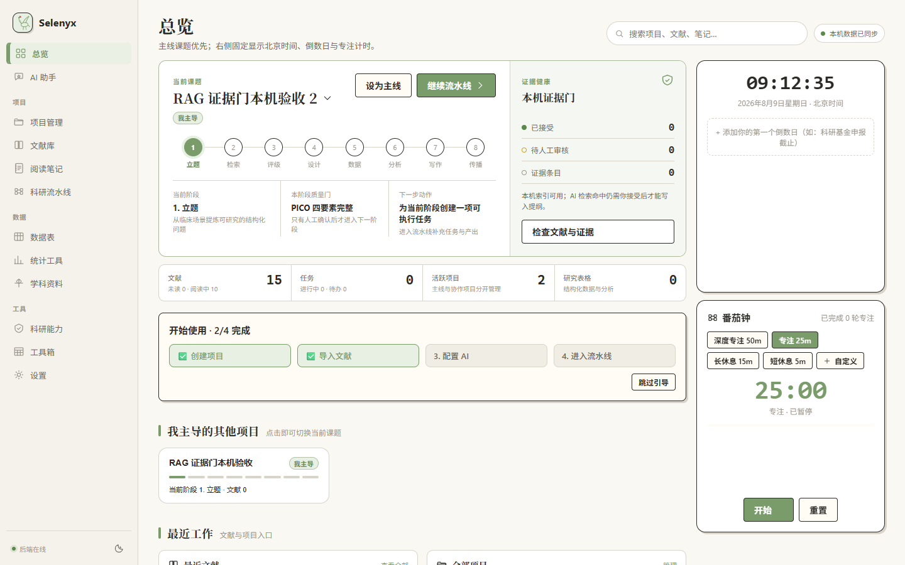
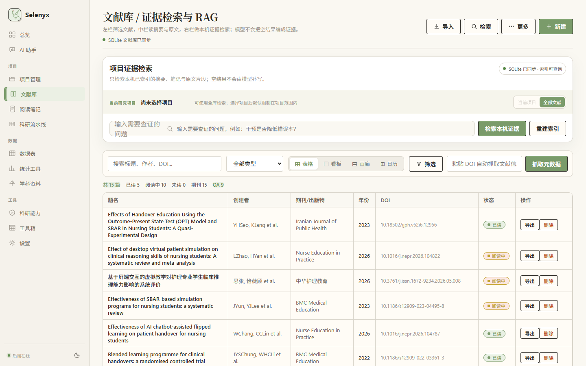
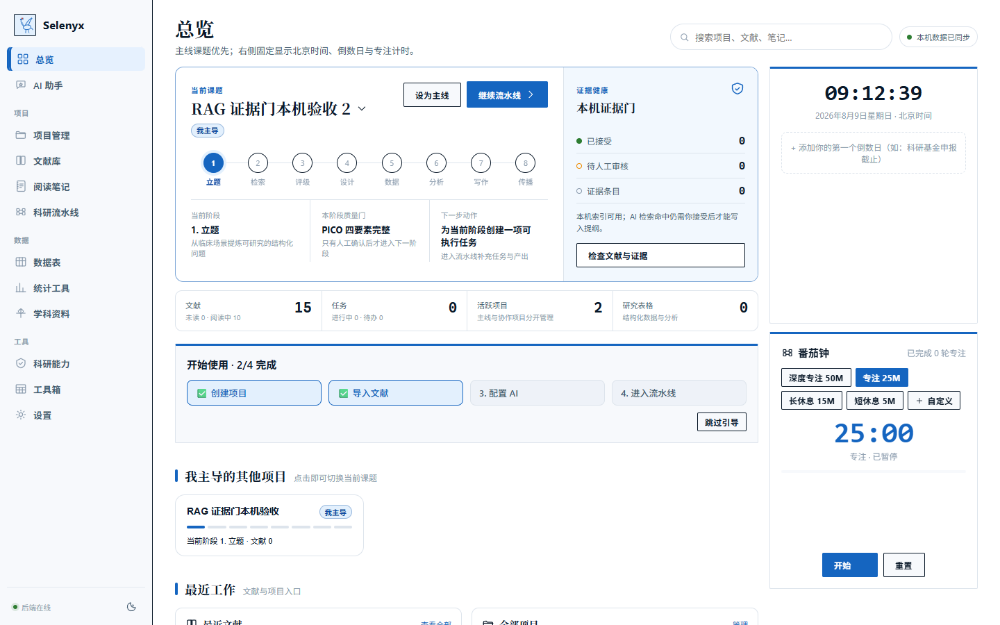
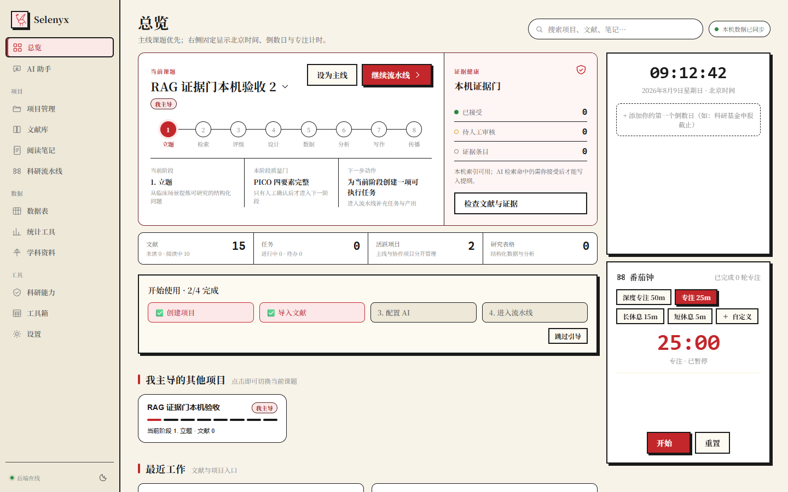

<div align="center">


# Selenyx 科研工作台

**本地优先 · 三栏工作台 · 八段证据门科研流水线**

展翼丹顶鹤为记 —— 安静、专注、行稳致远。

`React + TypeScript + Vite` &nbsp;·&nbsp; `Tauri 2 (Rust)` &nbsp;·&nbsp; `FastAPI + SQLite`

</div>

---

## 这是什么

Selenyx 把科研工作流收进**一个完全在你本机运行**的工作区：文献管理、PDF 阅读与批注、研究项目与八段流水线、统计工具、全学科资料、AI 辅助。数据存于本机 SQLite 与浏览器本地存储——**不注册、不上云、离线可用**。

> 功能真实性、原文可追溯、人工证据门，优先于装饰与功能数量。

## 界面

| 总览（主线课题 + 北京时间 + 番茄钟） | 文献库（行内导出/删除） |
|---|---|
|  |  |

### 三套主题 × 日夜 × 三档密度

同一份 DOM 与功能，只切换设计令牌，切换不重排信息架构：

| 纸间豆绿（默认） | 瑞士蓝 | 墨岩·新粗野 |
|---|---|---|
|  |  |  |

## 核心特性

- **三栏工作台**：适合研究的页面统一为「对象/目录 — 主工作区 — 上下文/证据检查器」。文献库、科研流水线、AI 助手、阅读笔记皆为三栏，可拖拽调宽、键盘可达（方向键）、宽度本地记忆。
- **八段证据门流水线**：立题 → 检索 → 评级 → 设计 → 数据 → 分析 → 写作 → 传播。每段有入口条件、质量门与人工确认；**只有人工接受的证据**才能进入写作与严格 AI 回答，引用可回跳原文。
- **文献库**：DOI / PMID / arXiv / BibTeX / RIS / CSL JSON 导入，本机 Zotero 只读导入（候选预览 → 去重 → 确认），重复项**合并**而非删除（保留标签/集合/笔记），PDF 阅读与批注，行内一键导出 / 删除。
- **本地 RAG**：结构化解析（保留页码/区域/字符偏移）→ 稀疏 + 稠密检索 → 重排 → 人工证据门；解析失败保留原文件并显示原因。
- **学术连接器**：OpenAlex / Crossref / PubMed / arXiv（限流 + 诚实空结果，绝不编造）。
- **AI 助手**：项目级会话隔离，BYOK / 本地后端网关；「仅依据已接受证据」开启后，无证据必拒答。
- **统计工具 / 全学科资料 / 工具箱**：名词、数值、公式、标准规范均标注来源与适用范围。

## 下载安装包

| 平台 | 文件 |
|---|---|
| Windows | `Selenyx_…_x64-setup.exe`（NSIS）/ `Selenyx_…_x64_en-US.msi` |
| macOS | `Selenyx_…_aarch64.dmg` |
| Linux | `.deb` / `.rpm` / `.AppImage` |

到 [**Releases**](https://github.com/pyrelio88-afk/Selenyx/releases) 下载最新版。标准安装包**不含** AI 模型与大型离线安装器；OCR / 嵌入 / 重排 / 生成模型按需单独安装、显示大小与许可证、可卸载，模型缺失不影响文献、笔记、统计与项目管理。

## 快速开始（开发）

前置：Node ≥ 20、Python（[uv](https://docs.astral.sh/uv/)）、桌面构建需 Rust。

```powershell
npm install
npm run dev:local   # 同时启动前端 + 本地后端（/api 代理）
```

仅前端（无 RAG/学术网关）：`npm run dev`

桌面应用：`npm run desktop:build`（含本机 FastAPI sidecar 打包，详见 [BUILD.md](BUILD.md)）。

## 验证

```powershell
npm run typecheck    # TypeScript
npm run lint         # ESLint
npm test             # 前端单元测试
npm run backend:test # 后端 pytest
npm run verify:local # 本地优先整体验证
```

## 技术栈

- **前端**：React + TypeScript + Vite（单文件构建）+ Zustand
- **桌面**：Tauri 2（Rust）
- **后端**：FastAPI + SQLite（本地 sidecar）
- **PDF / OCR**：pdf.js + anydoc

## 文档

- 架构：[ARCHITECTURE.md](ARCHITECTURE.md)
- 构建：[BUILD.md](BUILD.md)
- 本地 RAG / 嵌入：[docs/LOCAL-RAG-EMBEDDINGS.md](docs/LOCAL-RAG-EMBEDDINGS.md)
- 需求账本：[docs/REQUIREMENTS-LEDGER.md](docs/REQUIREMENTS-LEDGER.md)

## License

MIT
